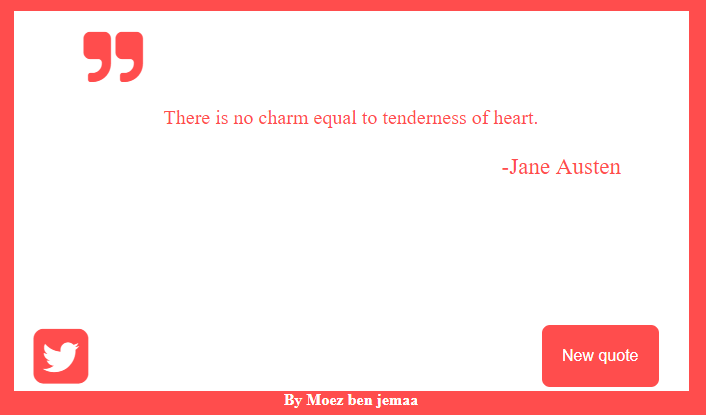

# Build Random Quote Machine
In this mini-project I have developed a  web application that make a random quote, as part of my full stack JavaScript training offered by [GOMYCODE Tunisia](https://www.gomycode.tn)
and this a link :https://moezbj.github.io/Quotes.io/
## Project brief
This is a small web application wich does the following:

<strong>User Story</strong>  I can click a button to show me a new random quote.

<strong>User Story</strong>  I can press a button to tweet out a quote.

The following screenshot shows my App:

    
    

 
 * make it responsive 

